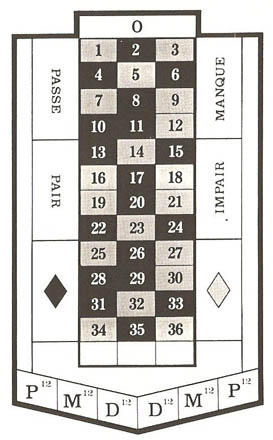

#Can you make money with the Martingale?

This page presents the martingale betting system for the roulette casino game. It analyzes with hard number the systems and determines whether you can reliably make money at the roulette with it.

#What is the roulette?

The roulette is a casino game dating back to the 17th century. A ball is rolled by the croupier into a spinning wheel and ends up into one of the 37 pockets numbered 0 to 36. Each number possesses a red or black color except the zero which is green.

A number of bets can be made as to where the ball will end up: a specific number, a small group of related numbers, an even or odd number (pair, impair), a number between 1-18 (manque), a number between 19-36 (passe), a red or black number. The martingale uses the red or black bets exclusively.

There exists a number of variations to this game but this article will focuses on the French roulette, also known as the European roulette. A popular variant is the American roulette with two zeros which makes your odds of winning lower. We will assume a minimum bet of 1 and no maximum. Some casino have minimum and maximum (eg.: minimum 3 and maximum 500). 

The number zero being green introduces a [house edge](https://en.wikipedia.org/wiki/Casino_game#House_advantage). There are 18 red and 18 black and one green number. When betting on a color, if the ball ends up on zero (which has 1/37 odd of occuring) neither red or black bets wins and the house get all those bets back. 
The [expected value](https://en.wikipedia.org/wiki/Expected_value) when betting on a color is `1*18/37 + -1*19/37 = -0.027`. The house has a 2.7% edge. This means that on average a player will lose 2.6% when betting.

#What is the martingale?
The martingale is one of the older and simpler technique to make money at the roulette. 

> Make a bet of one on a color  
> if you _win_: you doubled your bet. Make a new bet of one on the other color.  
> if you _lose_: double your previous bet on the same color until you win. 

Doubling after each loss allows the first victory to recover all previous losses. The only way to lose is to have a series of losses so long that you can no longer double the previous bet. This is the opposite of the usual way of playing games of chance where you take a lot of small losses hoping for a big win. With the martingale we have lots of small wins, hoping to avoid a large loss.

The martingale relies on the fact that even if the wrong color appears multiple times in a row, the winning color will [almost surely](https://en.wikipedia.org/wiki/Almost_surely) end up occuring. Indeed, the odds of winning each time is almost 50% (actually it is 18/37 due to the zero which always makes you lose).  

The following table shows the odds of losing multiple times in a row:

| Losses in a row | odds (%) | odds (1 in) |
|:---------------:|:--------:|:-----------:|
| 2               |  26.37 % |    1 in 4   |
| 4               |  6.95 %  |   1 in 14   |
| 6               |  1.83 %  |   1 in 55   |
| 8               |   0.48%  |   1 in 207  |
| 10              |  0.13 %  |   1 in 784  |
| 12              |  0.03 %  |  1 in 2974  |
| 14              |  0.01 %  |  1 in 11279 |

For other values, you can use the calculator below :  
The odds of losing <input type="number" value="13" min="0" id="oddsLosingXTimes"> times in a row is  % or 1 in . 

##Gaining one at a time

With the martingale you make a profit of one every time you win even if you had to double a previous bet due to a loss. As the following table shows, no matter how many times you lost and had to double the bet, the final profit is of one unit: 

|  Losses in a row  | Amount spent      | Amount won | Net win |
| :---------------: |-------------------|------------|---------|
|  1                | -1                | +2         | =1      |
|  2                | -3 (-1 -2)        | +4         | =1      |
|  3                | -7 (-1 -2 -4)     | +8         | =1      |
|  4                | -15 (-1 -2 -4 -8) | +16        | =1      |
|       ...         |        ...        |     ...    | =1      |

Since you only win one at a time, to gain a large amount of money, you will need to play a larger amount of time.

#Experiment

To analyze the martingale, a roulette computer simulation has been embedded in this page. It works just like a real casino roulette except we have the leisure to play as much as we want without losing any real money.

<!-- TODO roulette simulator:
can select money available (or start with 100 and reset)
can select color
can select amount bet
button to play 

    display last result
-->

The winning number and color is generated randomly by our simulated wheel as randomly as a [computer number generator](https://en.wikipedia.org/wiki/Pseudorandom_number_generator) can. It is for all intents as random as a casino wheel should be.

To help determine if the martingale betting technique works we are going to use the [Monte Carlo method](https://en.wikipedia.org/wiki/Monte_Carlo_method). We will automatically simulate a large number of attempts to make money with the martingale and see what happens.  
For each attempt we will start with a predetermined amount of money and a predetermined amount of money we want to win. <!--expressed as a percentage of the initial amount.--> We keep playing until one of two things happen:

- we amassed the amount of money we set ourselves to
- we are unable to bet the double of the previous loss due to an unlucky strike of numbers of the wrong color

Let's simulate 50 attempts, starting with 100 units, aiming to gain 20 units to achieve a total of 120 units. The following graph plots the result of those 50 attempts.  
Each dot represent an entire playing session. It is as if for each dot we had been to a casino and played until we came out a happy and richer person or a bitter loser. This graph has been generated dynamically using the embedded simulation. If you refresh the page you will get another set of results.

<!-- 

-->

<iframe scrolling="no" style="display: block; float: left; border: none; overflow: hidden;" width="100%" height="350" src="scattermartingale.html?hideControls=1&initial=100&goal=120"></iframe>

As you can see, when starting with 100 and trying to gain an additional 20 units, we win most, but not all of the time. An important aspect to notice is that when we win, we win a little (20) but when we lose, we lose a lot (around 50).

##Upping the ante

Here is another chart, it is set with the same initial amount (100) but this time we want to double it, ending up with 200. As the chart reveals, with these parameters we only manage to double our capital a few times and lose most of the time. 

<!-- 

-->

<iframe scrolling="no" style="display: block; float: left; border: none; overflow: hidden;" width="100%" height="350" src="scattermartingale.html?initial=100&goal=200"></iframe>

You can adjust the parameters above to run the simulator and perform your own experiments.

There are two ways to influence the likelihood of victory: after how long you stop and the initial amount of money you possess  :

- The longer you play the higher the odds of losing. Another way of saying this : the more you want to win, the higher the risks of losing.  
Try setting a higher goal and observe the effect. The more you aim to win, the more likely you are to fail. On the contrary, the less you aim to win, the more likely you are to succeed. 
- The higher the initial amount of money available, the more likely you are to succeed. This is because more money allows you to overcome longer losing strikes. For example if you want to gain 100 more units than you started with, you are much more likely to achieve this goal if you have 1000 units to start with than if you only had 100.  
Set the initial amount to 100 and the goal to 200. Notice the low number of successfull attempts. Now set the initial amount to 1000 and the goal to 1100. There are few if any unsuccessfull attempts but each of those failure result in a large loss of money.

##Average return

The martingale attempts sometimes succeed and sometimes fail. A varying amount of money is made or lost for each of those attempts, but on average how much money is made? If on average we make more money than the initial bet it would mean that we beat the [house edge](#houseEdge) of the casino. 

This question can be answered experimentally using the roulette simulator. By playing a large number of martingales and averaging the results it will be possible to estimate how much money is made on average.  

The following test runs 100,000 martingales with the parameters defined and return the average of all the results: 

When starting with <input type="number" value="100" min="0" max="1000" id="averageStarting"> and attempting to gain <input type="number" value="20" min="0" max="500" id="averageGain">, the average result is  97.06788. 

 Be careful not to select values too large as it would slow your browser down. The resulting number will be slightly different between multiple execution due to the experimental nature of the number. A more accurate result could be obtained but it would require more computation and slow your browser down.

As you can see the average result is always slightly less than the starting amount.

__On average, the money remaining after a martingale is less than at the start!__

<!-- TODO distribution chart-->

#Success Probability

Just how likely is it to win using the martingale? As shown by the previous section, the probability of success depends on the starting amount as well as the amount of profit desired.

Let's compute the actual odds of winning and display them using graphs. The graphs below are not obtained through simulation, these are the actual odds of winning the roulette using the martingale. Again, success is defined as gaining a predetermined amount of money while losing is defined as being unable to double a bet after a loss at some point.

The following chart displays the odds of winning at the roulette using the martingale when starting with 100. The horizontal axis represents the desired profits. The vertical axis is the probability of success. 

<iframe style="display: block; float: left; border: none; overflow: hidden" width="100%" height="450px" src="winningoddsmartingale.html?initial=100&gains=0,40,80,120,160,200"></iframe>

You can modify the graph by chosing your own initial value and gains. Separate the values by a comma.

As expected there is 100% percent chances of gaining 0 additional units: by not playing at all.  
The more you hope to gain the less your chances of success. The reason being that the more you play, the higher the risks of getting an unlucky strike of numbers of the wrong colors. Gaining 25 has a 62% probability of success, gaining 50 less than 50%, gaining 100 30% and gaining 200 less than 15%. 
The following graph shows the odds of winning a larger amount of money. Up to 10 times the initial amount.

<iframe style="display: block; float: left; border: none; overflow: hidden" width="100%" height="450px" src="winningoddsmartingale.html?hideControls&initial=100&gains=0,25,50,100,200,300,400,500,600,700,800"></iframe>

The probability of winning at the roulette using the martingale follows the characteristic shape of a [Power law](https://en.wikipedia.org/wiki/Power_law). This means that odds of winning decline exponentially with the duration of the game.

__The probability of winning become negligeable when you want to win a large amount!__

#Why doesn't the martingale work?

The only way to lose using the martingale is to have a series of failures long enough so that you can no longer afford to double the previous bet. The question is, will such a series occur?

Three facts:

1. since the money you have is limited, 
 __the number of times you can lose in a row is limited__
2. since you only win money [1 unit at a time](#gainoneatatime), you __need to play a lot__ to make decent gains
3. __a long losing strike is unlikely... unless you play a long time, in which case it is almost guaranteed to happen!__

Each individual attempt to win appears low-risk but you will periodically experience a long series of failures in a row. This is called a [Taleb Distribution](https://en.wikipedia.org/wiki/Taleb_distribution): Steady returns that appear low risk but which experiences periodical catastrophic events.

##How likely is it to be unlucky?

There is less than 2 percent chance of red (or green) appearing 6 times in a row. Unlikely to happen. Unlikely if you only bet once that is. If you keep playing, a series of 6 red will happen sooner or later. How many times do you have to play before it is more likely for it to happen than not? 10 times? 50 times? 100 times? The answer 38. After 38 times there is 50% chances that you will have encountered 6 red in a row.  

[Psychology studies](http://wizardofodds.com/image/ask-the-wizard/streaks.pdf) have shown that when people realize that the odds of losing 6 times in a row are low when playing a few times, they then incorrectly assume that in a long string of play the odds are also low. 
It's a mistake of thinking that if a series of red/red/red/red happens then the next color is more likely to be black to compensate. This is known as the [Gambler's fallacy](https://en.wikipedia.org/wiki/Gambler%27s_fallacy). It's a quirk of how our human brain work.

<!--
-Erreur du parieur
    si quelque chose d'improbable se produit, les tirages suivants vont compenser
    ex.: noir, noir, noir, noir -> suivant sera rouge!
    http://fr.wikipedia.org/wiki/Erreur_du_parieur
    http://jos26.com/2012/01/casinos/martingale-empechez-aux-casinos-de-detecter-votre-facon-de-joue\
r/

-human tendency to think in term of luck. lucky strike,...
 online casino cheat: not random, detect and make me lose!
    cf how likely being unlucky kdice
-->

Here is a table showing for various length of consecutive losses, the number of times you have to play before there is a greater than 50% chances of it happening and the minimum amount of money needed to still be able to play if it happens.
<!--
(19/37)^6

(1-(19/37)^6)

(1-(19/37)^6)^38

odds of losing 6 times in a row, when playing 3 times
=
odds of losing the first time + 
odds of winning first time and losing second time +
odds of winning first and second time and losing third time
=
(19/37)^6 + (1-(19/37)^6) * (19/37)^6 + (1-(19/37)^6) * (1-(19/37)^6) * (19/37)^6

=
1 - odds of not losing 6 times in a row, when playing three times
=
1- (1-(19/37)^6)^3
=

-->

| Losses in a row | Times before > 50% | Bankroll needed |
|-----------------|--------------------|-----------------|
| 3               | 5                  | 7               |
| 4               | 10                 | 15              |
| 5               | 20                 | 31              |
| 6               | 38                 | 63              |
| 7               | 74                 | 127             |
| 8               | 144                | 255             |

As a rough rule of thumb, you have more than 50% chances of losing your money if you try to win 50% of your initial available amount. Keep playing and you'll be certain to lose your money.

<!-- -how likely is it to be unlucky?
    with x amount of money can do y attempts before losing it all
    how likely is it to lose y times starting with x amount?
    (dynamic table here)
    1 chance in x to lose! how likely is it?
    http://kdice.wikispaces.com/Random+in+kdice

-->

<!--
TODO finish this
#Maximizing the odds of success when using Martingale

##Optimal Initial amount of money

The choice of the initial amount of money to play with affects the number of times it is possible to double a bet after multiple losses. This choice can have a significant impact.

For example look at the following chart of success probabilities.

<iframe style="display: block; float: left; border: none; overflow: hidden" width="100%" height="450px" src="winningoddsmartingale.html?initial=117,119,121,123,125,127,129&gains=10,40,80,120"></iframe>
TODO winning odds chart with multiple series
eg around 127
TODO reprendre martingale taux succes115_129.png (win rate!)

Each line represent a different starting amount. The odds changes depending on the starting amount because it affects the length of consecutive losses that can be handled.

For example playing 7 times in a row require `1+2+4+8+16+32+64` = 127 units. A smaller bankroll, of even one less unit, means you cannot play 7 times. A larger bankroll still only allows you to play 7 times; until you hit 255, which allows to play 8 times in a row.

Over time 

The following tables shows how much you need to be able to 

step function.

effect bigger when starting to play

initial money to be able to lose x times in a row, right from the start : 2^(x-1)

-->

#Risking more to increase chances of success

The following probability chart confirms that the odds of winning increase when you have a larger amount of money available.

<iframe style="display: block; float: left; border: none; overflow: hidden" width="100%" height="450px" src="winningoddsmartingale.html?initial=100,200,300,500&gains=0,50,100,200,300,400,500"></iframe>

Indeed, a larger bankroll means that when a series of numbers of the wrong color occurs, you can double the bets you make longer. So, does this mean that if you were a millionaire you could fleece casinos by using the martingale technique at the roulette? The answer is no.

First, the amount of money you need to be able to cope with longer series of failures grows very quickly. It grows [quadratically](https://en.wikipedia.org/wiki/Quadratic_growth).  
<!--The amount of money you need o be able to play (and lose) `X` times in a row is `2^X - 1`.-->
Simply put it means that if you want to be able to lose one more time you need twice the money. It may not seem like much but this makes the amounts of money you need quickly grow out of control. For example you only need 31 to be able to play 5 times in a row. To play 10 times in a row, you need 1023. To play 15 times in a row you need 32767. The ability to play 20 times already requires more than 1 million. The numbers after that get obscene.  
The only way to be sure to win would be to have infinitely big pockets (and casinos accepting infinitely big bets).
<!--put story of chess gold
> The legend goes that when the game of chess was invented, the ruling king was so pleased that he let its inventor chose his own reward. The man said that he simply wanted wanted
-->

Second, while more money increase the odds it also increases the losses when they do occur. No matter how large the initial bet is, the [average return](#averageReturn) is still negative.  Remember that if you lose the losses can be way higher than when you win. For example if you set to win 10% of your initial investment, you may win the 10% or you could potentially lose 100% of your money.

Third, the more money you have the more money you'll want to win. It is naive to think: _'I only have 100 to play with. My chances of doubling that money are low. If only I had 10000 I would be able to make 100 almost certainly!'_.  
While the odds of winning 100 when starting with 100000 are high, it is unlikely you'd bother playing for so little. When playing you are more likely to want to win a significant percentage of your initial bet. When you set out to win 50%, 100% or more of your initial amount, the odds of winning are bad, no matter the initial amount. 

<!--Also, as explained in a later section, with the martingale, you only win 1 unit at a time. Gaining any significant amount would take a long long time.-->

#A useful use of martingale

While the martingale is not a sure-fire way to make lots money at the roulette we still can use it to our advantage. 

Betting on a color at the roulette has a 50% chances of being successfull (18/37 actually). Using the martingale, we can __turn the roulette from 50/50 odds game into a game which gives whatever chances of success we desire.__ With a given starting amount and percentage of success, we can calculate how long we can play and still have the desired percentage of success.

For example if we have 100 to play with and we want 80% chances of winning, we must play until we possess 112. Anymore than that and the odds of losing would be higher. At 115 the odds are of 75% and by 150 they are lower than 50%.

You can use the success probability chart to determine how much you can play to retain a certain percentage off success.
<!-- todo if time: calculator
TODO calculator
can select initial money
can select odds of winning in %
gives the amount of money to win

TODO You can also use the Success probability chart in this page.
-->

#Conclusion

The martingale seems attractive due to its perceived ability to prevent losses but it is an illusion. Using the martingale you _will_ end up losing. It's a matter of time

#---

#FAQ

##Can't I just play once in a while with modest goals?

Since playing with modest gains has high chances of success it might seem like a good idea to play a little at multiple occasions, enjoying high chances of success each time. 
However this does not work. Even if each individual session has low odds of failure, if you keep playing you will sooner or later end up losing; wiping out previous gains in the process. Another way of understanding this is that playing a little multiple times turns into the equivalent of playing a lot once.

<!--
-argument: 'it works but don't do it too much'-> if it works, it works.
    Why wouldn't you give up your job and make easy money?
-->

##Is it really not possible to beat the casino?

Making money reliably at the roulette _is_ possible in some curcumstances. Several people successfully did it over the years. Finding a wheel with bias towards certain numbers, using the laws of physics and a machine to compute where the ball would end up,... Cheating excepted, every case involved finding find a way to detect some kind of bias in order to reverse the [house edge](https://en.wikipedia.org/wiki/Casino_game#House_advantage) in the favour of the player.

##Can I use the martingale using a bet different than a color?

The martingale is typically described as chosing a color and keep betting on this color after each loss (while doubling the bet) until a win. In reality the color chosen each time makes no difference at all. Whether you pick red or black, the odds of winning always are 18/37. Picking black and hoping that a long series of red/red/red/... won't occur is just as good of a strategy as picking black/red/black/... and hoping that a long series of red/black/red/... won't happen.  

Old statistician (unfunny) joke: A man says to a statistician friend, 'this morning when I parked, the licence plate of the car next to mine was 'aaa111', what were the odds?! The statistician respond 'This happened to me too but the licence plate of the car next to mine was ajh214!'

When using the martingale bets other than the color could be used with: manque (between 1 and 18) or passe (between 19 and 36); even or odd. In all cases the odds are the same (18/37).

<!--
-roulette variants?
    00 american -> worse odds
    prison/half back -> better odds (but still doesn't work)
-->

##You only analyzed one specific technique, can't a variant or another betting technique work?

The martingale analyzed here is one of the many techniques aiming to make money at the roulette: grand martingale, Alembert, Pertoli, geometric bet, constant bet,... It seems that the human mind is highly imaginative when it comes to way of making money.

While each technique could be the subject of its own article, the premise remains the same : the odds are always in the favor of the house.

<!--
-other strategies (alembert,...) -> none work!
    *2+1 (grande martingale) -> increases faster, have to give up quicker
    start at 3 as in casinos -> increases faster
-->

